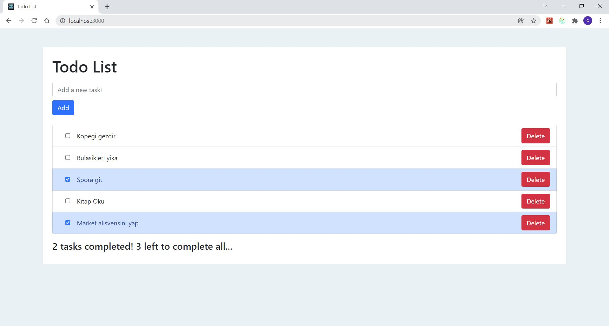
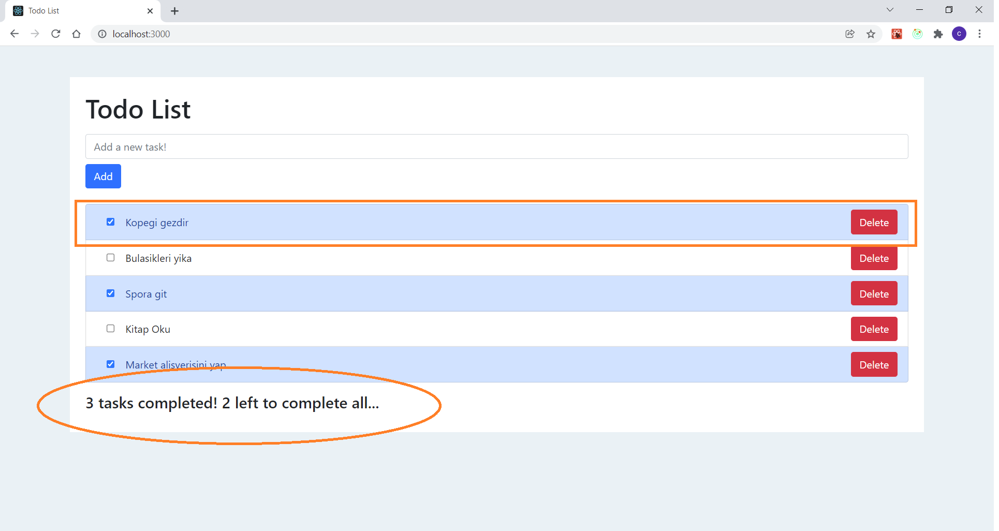
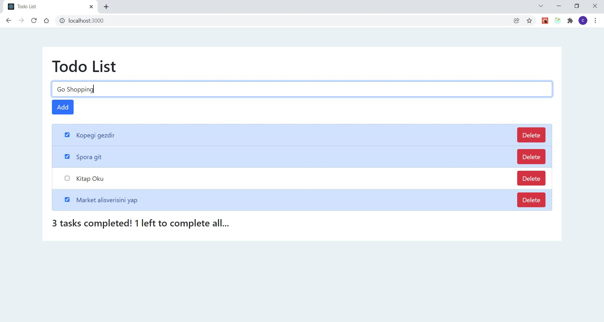
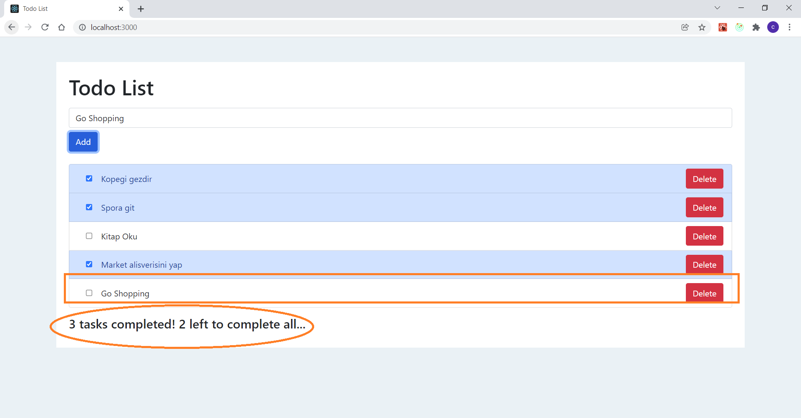
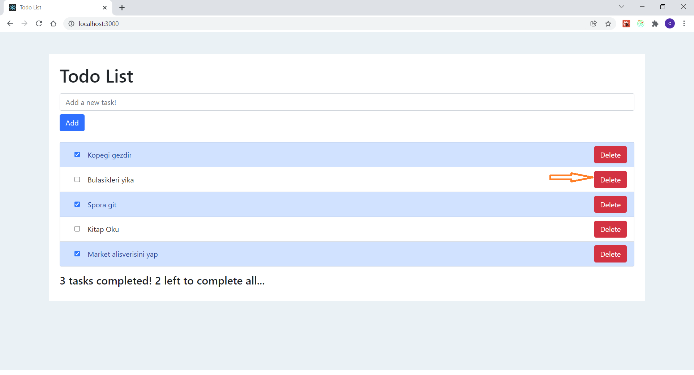

# TodoList Project
This project has been developed by Cem Eroglu

## Cloning
  Make sure Node.js is installed to your computer.(https://nodejs.org/en/)<br/>
  Clone the project from my Git repository. 
  Command: 
  ```sh
  git clone https://github.com/CemEroglu/ToDoList.git
  ```

  You can also find from my Github account: 
  ```sh
  https://github.com/CemEroglu 
  ```

## Installing and running Fake Back-end
  Change directory to the project folder: 
  ```sh
  cd TodoList
  ```
  Change directory to the back-end folder: 
  ```sh
  cd api 
  ```
  Run " npm install " to install node_modules:
  ```sh
  npm install
  ```
  Run "npm run server" to start the project. It will serve from 7000 port. Don't close the command line until whenever you will also close the UI:
  ```sh
  npm run server
  ```

## Installing and running React App 
  Change directory to the project folder: 
  ```sh
  cd TodoApp
  ```
  Change directory to the UI folder: 
  ```sh
  cd todolist
  ```
  Run " npm install " to install node_modules:
  ```sh
  npm install
  ```
  Run "npm start" to start the project. It will open a window on your default browser automatically. You can also view http://localhost:3000/ on your browser:
  ```sh
  npm start
  ```
## First Look of the project
After setting up everything, the project should seem like below. It has an input to add new tasks, tasklist to check or delete tasks. Finally, a summary part to show your progress.

## Check a task
You can check a completed task from the checkbox on the left. You can see that the summary part in the end of the page is also refreshed.

## Adding a new task
You can add a new task from the input which is on the top of the page.

## Effect of adding a new task on Summary
You can see the new task on your list. It is not checked because of the default state. You can also also observe that the summary part also changed because of the new task you have just added.

## Delete a task
You can delete a task from the delete button on the left.

## Effect of deleting a task on Summary
After deleting a task, you can observe that the summary part would change depending on the state of the deleted task.

## Communication
You can reach me via my e-mail for anything related: cemeroglu96@gmail.com
